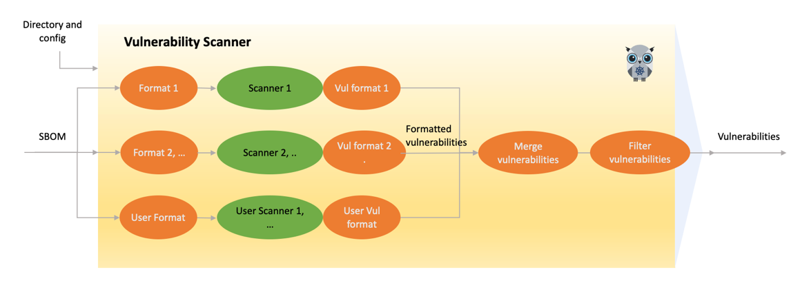



The scanners use the information contained in the [SBOM]() to identify vulnerabilities and potential security risks within software applications. Vulnerability scanners use SBOM information to:

- Identify vulnerable components: Scanners use the SBOM to identify a software application’s components, then cross-reference this information with known vulnerabilities and security issues to identify vulnerable components within the software.
- Prioritize vulnerabilities: After the vulnerability scanner has identified all vulnerable components within the software application, it uses the SBOM to prioritize the vulnerabilities so you can focus on the most critical vulnerabilities.
- Identify supply chain risks: SBOMs provide visibility into the software supply chain, enabling vulnerability scanners to identify third-party or security risks. As a result, organizations can mitigate supply chain risks and reduce their overall security exposure.
- Track changes and updates: Software vulnerability scanners use SBOM information to determine whether software changes have introduced new vulnerabilities or security risks.

The SBOM is a critical tool for vulnerability scanners, providing the information needed to identify, prioritize, and mitigate security risks within software applications. In addition, scanners also rely on other types of inputs, as listed below.

## KubeClarity and vulnerability scanning

KubeClarity isn’t a vulnerability scanner but integrates with top opensource vulnerability scanners. It also helps with prioritization and risk management by visualization and filtering. It is often necessary to prioritize CVEs because of the sheer volume of identified CVEs. With KubeClarity’s vulnerability trending dashboard and APIs, you can locate and double-click into a specific CVE in your application or infrastructure.

KubeClarity features a range of flexible and dynamic filters that help map CVEs down to an application->package->Image level. Additionally, it normalizes reports from multiple scanners and calculates missing [CVSS (Common Vulnerability Scoring System) scores](https://www.first.org/cvss/specification-document).



KubeClarity supports both automatic scans to find common vulnerabilities quickly and efficiently, and manual scans to help verify automated scans, and also to help identify more complex and less common vulnerabilities. In addition to conventional scans, KubeClarity also provides multi-scanner integration.

## Multi-scanner architecture

KubeClarity infrastructure enables multiple scanners’ configuration and simultaneous operation. Scanners in KubeClarity are designed to work in parallel.

The following figure shows the multi-scanner architecture for vulnerability scanning: KubeClarity preprocesses the SBOMs so they conform to the specific formatting requirements of the specific scanner. Each scanner may have different types and unique formatting expectations. The scanners analyze the incoming data and generate vulnerability outputs in their native formats.

KubeClarity can merge the vulnerability reports of different scanners, to include severity levels, sources, and available fixes. These reports serve as valuable outputs, allowing you to filter and focus on specific areas of vulnerabilities for further investigation and resolution.

## Run vulnerability scans

For details on running vulnerability scans with KubeClarity, see the {} and {}.
