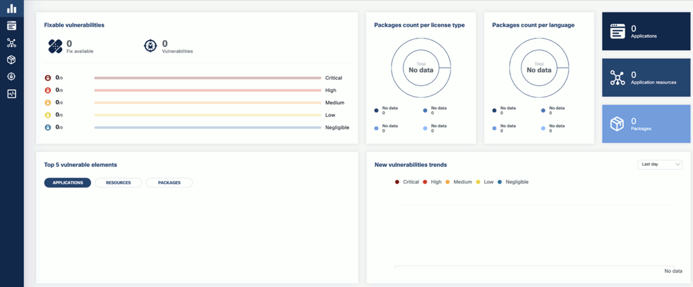

You can install the KubeClarity backend using [Helm](#install-using-helm), or you can [build and run it locally](#build-locally).

## Prerequisites

KubeClarity requires these Kubernetes permissions:

| Permission | Reason |
| ---        | ---    |
| Read secrets in CREDS_SECRET_NAMESPACE (default: kubeclarity) | This allows you to configure image pull secrets for scanning private image repositories. |
| Read config maps in the KubeClarity deployment namespace. | This is required for getting the configured template of the scanner job. |
| List pods in cluster scope. | This is required for calculating the target pods that need to be scanned. |
| List namespaces. | This is required for fetching the target namespaces to scan in K8s runtime scan UI. |
| Create and delete jobs in cluster scope. | This is required for managing the jobs that scan the target pods in their namespaces. |

### Prerequisites for AWS

If you are installing KubeClarity on AWS, complete the following steps. These are needed because KubeClarity uses a persistent PostgreSQL database, and that requires a volume.

1. Make sure that your EKS cluster is 1.23 or higher.
1. Install the **EBS CSI Driver** EKS add-on. For details, see [Amazon EKS add-ons](https://docs.aws.amazon.com/eks/latest/userguide/eks-add-ons.html).
1. Configure the EBS CSI Driver with IAMServiceRole and policies. For details, see [Creating the Amazon EBS CSI driver IAM role](https://docs.aws.amazon.com/eks/latest/userguide/csi-iam-role.html).

## Install using Helm

1. Add the Helm repository.

    ```shell
    helm repo add kubeclarity https://openclarity.github.io/kubeclarity
    ```

1. Save the default KubeClarity chart values.

    ```shell
    helm show values kubeclarity/kubeclarity > values.yaml
    ```

1. (Optional) Check the configuration in the `values.yaml` file and update the required values if needed. You can skip this step to use the default configuration.

    - To enable and configure the supported SBOM generators and vulnerability scanners, check the `analyzer` and `scanner` configurations under the `vulnerability-scanner` section. You can skip this step to use the default configuration settings.

1. Deploy KubeClarity with Helm.

    - If you have customized the `values.yaml` file, run:

        ```shell
        helm install --values values.yaml --create-namespace kubeclarity kubeclarity/kubeclarity --namespace kubeclarity
        ```

    - To use the default configuration, run:

        ```shell
        helm install --create-namespace kubeclarity kubeclarity/kubeclarity --namespace kubeclarity
        ```

    - For an OpenShift Restricted SCC compatible installation, run:

        ```shell
        helm install --values values.yaml --create-namespace kubeclarity kubeclarity/kubeclarity --namespace kubeclarity --set global.openShiftRestricted=true \
        --set kubeclarity-postgresql.securityContext.enabled=false --set kubeclarity-postgresql.containerSecurityContext.enabled=false \
        --set kubeclarity-postgresql.volumePermissions.enabled=true --set kubeclarity-postgresql.volumePermissions.securityContext.runAsUser="auto" \
        --set kubeclarity-postgresql.shmVolume.chmod.enabled=false
        ```

1. Wait until all the pods are in 'Running' state. Check the output of the following command:

    ```shell
    kubectl get pods --namespace kubeclarity
    ```

    The output should be similar to:

    ```shell
    NAME                                                    READY   STATUS    RESTARTS   AGE
    kubeclarity-kubeclarity-7689c7fbb7-nlhh5                1/1     Running   0          82s
    kubeclarity-kubeclarity-grype-server-79b6fb4b88-5xtbh   1/1     Running   0          82s
    kubeclarity-kubeclarity-postgresql-0                    1/1     Running   0          82s
    kubeclarity-kubeclarity-sbom-db-6895d97d5d-55jnj        1/1     Running   0          82s
    ```

1. Port-forward to the KubeClarity UI.

   ```shell
   kubectl port-forward --namespace kubeclarity svc/kubeclarity-kubeclarity 9999:8080
   ```

1. (Optional) Install a sample application (sock shop) to run your scans on.

    1. Create a namespace for the application.

        ```shell
        kubectl create namespace sock-shop
        ```

    1. Install the application.

        ```shell
        kubectl apply -f https://raw.githubusercontent.com/microservices-demo/microservices-demo/master/deploy/kubernetes/complete-demo.yaml
        ```

    1. Check that the installation was successful.

        ```shell
        kubectl get pods --namespace sock-shop
        ```

        Expected output:

        ```shell
        NAME                            READY   STATUS    RESTARTS   AGE
        carts-5dc994cf5b-4rhfj          2/2     Running   0          44h
        carts-db-556cbbd5fb-64qls       2/2     Running   0          44h
        catalogue-b7b968c97-b9k8p       2/2     Running   0          44h
        catalogue-db-f7547dd6-smzk2     2/2     Running   0          44h
        front-end-848c97475d-b7sl8      2/2     Running   0          44h
        orders-7d47794476-9fjsx         2/2     Running   0          44h
        orders-db-bbfb8f8-7ndr6         2/2     Running   0          44h
        payment-77bd4bbdf6-hkzh7        2/2     Running   0          44h
        queue-master-6d4cf8c4ff-pzk68   2/2     Running   0          44h
        rabbitmq-9dd69888f-6lzfh        3/3     Running   0          44h
        session-db-7d9d77c495-zngsn     2/2     Running   0          44h
        shipping-67fff9d476-t87jw       2/2     Running   0          44h
        user-7b667cd8d-q8bg8            2/2     Running   0          44h
        user-db-5599d45948-vxpq6        2/2     Running   0          44h
        ```

1. Open the KubeClarity UI in your browser at [http://localhost:9999/](http://localhost:9999/). The KubeClarity dashboard should appear. KubeClarity UI has no data to report vulnerabilities after a fresh install, so there is no data on the dashboard.

    

1. If you also want to try KubeClarity using its command-line tool, {}. Otherwise, you can run [runtime scans using the dashboard]().

## Uninstall using Helm

Later if you have finished experimenting with KubeClarity, you can delete the backend by completing the following steps.

1. Helm uninstall

   ```shell
   helm uninstall kubeclarity --namespace kubeclarity
   ```

2. Clean the resources. By default, Helm doesn't remove the PVCs and PVs for the StatefulSets. Run the following command to delete them all:

    ```shell
    kubectl delete pvc -l app.kubernetes.io/instance=kubeclarity --namespace kubeclarity
    ```

## Build and run locally with demo data {#build-locally}

1. Build the UI and the backend and start the backend locally, either using Docker, or without it:

    - Using docker:
        1. Build UI and backend (the image tag is set using VERSION):

            ```shell
            VERSION=test make docker-backend
            ```

        1. Run the backend using demo data:

            ```shell
            docker run -p 9999:8080 -e FAKE_RUNTIME_SCANNER=true -e FAKE_DATA=true -e ENABLE_DB_INFO_LOGS=true -e DATABASE_DRIVER=LOCAL ghcr.io/openclarity/kubeclarity:test run
            ```

    - Local build:
        1. Build UI and backend

            ```shell
            make ui && make backend
            ```

        1. Copy the built site:

            ```shell
            cp -r ./ui/build ./site
            ```

        1. Run the backend locally using demo data:

            ```shell
            FAKE_RUNTIME_SCANNER=true DATABASE_DRIVER=LOCAL FAKE_DATA=true ENABLE_DB_INFO_LOGS=true ./backend/bin/backend run
            ```

1. Open the KubeClarity UI in your browser: [http://localhost:9999/](http://localhost:9999/)
1. {}.
