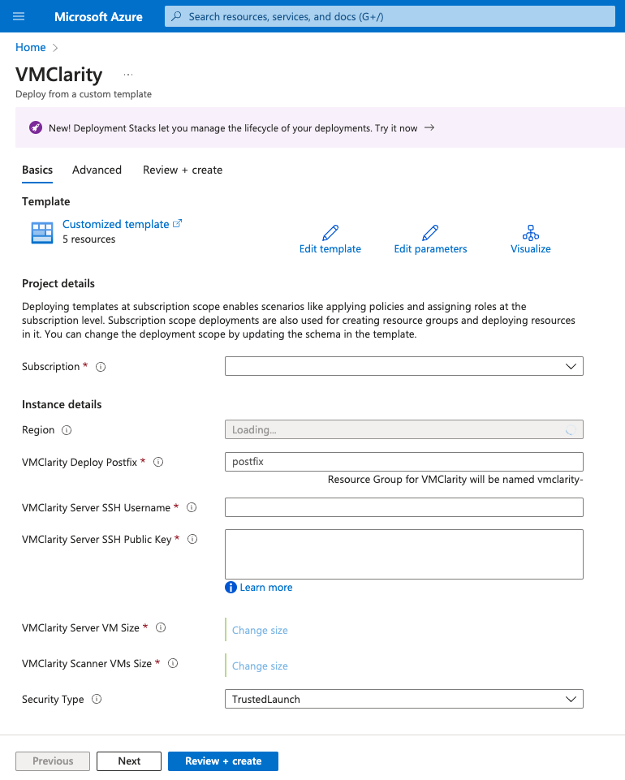
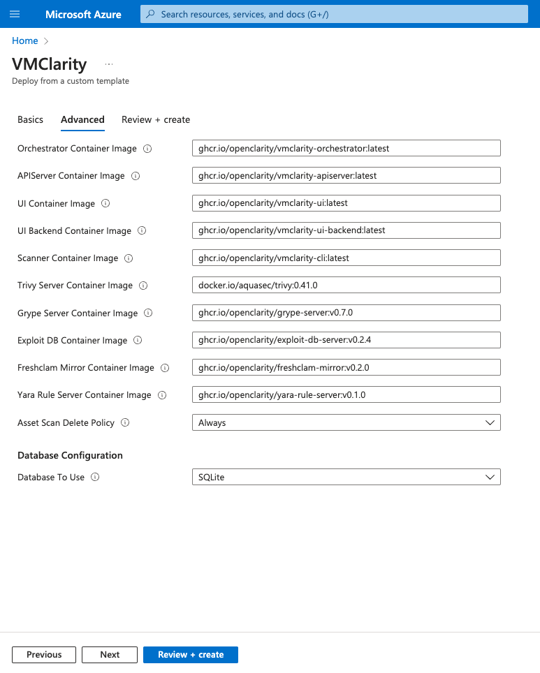

## Prerequisites

* Have an Azure subscription.
* Create an SSH public key for Linux. Please follow [these instructions for Linux and Mac users](https://learn.microsoft.com/en-gb/azure/virtual-machines/linux/mac-create-ssh-keys?WT.mc_id=Portal-fx) or [these for Windows users](https://learn.microsoft.com/en-gb/azure/virtual-machines/linux/ssh-from-windows). Once you have an RSA private key, convert it to an SSH2 public key with:

    ```sh
    ssh-keygen -e -f ~/.ssh/id_rsa.pub > ~/.ssh/id_rsa2.pub
    ```

## Deployment steps

1. Click [here](https://portal.azure.com/#blade/Microsoft_Azure_CreateUIDef/CustomDeploymentBlade/uri/https%3A%2F%2Fraw.githubusercontent.com%2Fopenclarity%2Fvmclarity%2Fmain%2Finstallation%2Fazure%2Fvmclarity.json/uiFormDefinitionUri/https%3A%2F%2Fraw.githubusercontent.com%2Fopenclarity%2Fvmclarity%2Fmain%2Finstallation%2Fazure%2Fvmclarity-UI.json) to deploy VMClarity's custom template.

1. Fill out the required **Project details** and **Instance details** in the **Basics** tab.

    <p align="center" width="100%">
        
    </p>

    You can set the following parameters:

    | Parameter                             | Required | Description                                                                                               |
    |---------------------------------------|----------|-----------------------------------------------------------------------------------------------------------|
    | Subscription                          | True     | Azure subscription where resources will be billed.                                                        |
    | Region                                | False    | Azure region where resources will be deployed.                                                            |
    | VMClarity Deploy Postfix              | True     | Postfix for Azure resource group name (e.g. `vmclarity-<postfix>`).                                       |
    | VMClarity Server SSH Username         | True     | SSH Username for the VMClarity Server Virtual Machine.                                                    |
    | VMClarity Server SSH Public Key       | True     | SSH Public Key for the VMClarity Server Virtual Machine. Paste the contents of `~/.ssh/id_rsa2.pub` here. |
    | VMClarity Server VM Size              | True     | The size of the VMClarity Server Virtual Machine.                                                         |
    | VMClarity Scanner VMs Size            | True     | The size of the VMClarity Scanner Virtual Machines.                                                       |
    | Security Type                         | False    | Security Type of the VMClarity Server Virtual Machine, e.g. `TrustedLaunch` (default) or `Standard`.      |

1. (Optional) In the **Advanced** tab, modify the **Container Image** for each service if a specific VMClarity version is required. Then, select the delete policy and the database.

    <p align="center" width="100%">
        
    </p>

    | Parameter                             | Required | Description                                                                                               |
    |---------------------------------------|----------|-----------------------------------------------------------------------------------------------------------|
    | *Service* Container Image             | True     | Docker Container Image to use for each service.                                                           |
    | Asset Scan Delete Policy              | True     | Delete Policy for resources created when performing an asset scan, e.g. `Always`, `OnSuccess` or `Never`. |
    | Database To Use                       | True     | Database type to use, e.g. `SQLite`, `PostgreSQL` or `External PostgreSQL`.                               |

1. Click **Review + create** to create the deployment.

1. Once the deployment is completed successfully, copy the VMClarity SSH address from the **Outputs** tab.

    <p align="center" width="100%">
        
    </p>

1. Open an SSH tunnel to VMClarity the server

```shell
ssh -N -L 8080:localhost:80 -i  "<Path to the SSH key specified during install>" ubuntu@<VmClarity SSH Address copied during install>
```


1. Open the VMClarity UI in your browser at [http://localhost:8080/](http://localhost:8080/). The dashboard opens.

    

1. (Optional) If needed, you can access the API at[http://localhost:8080/api](http://localhost:8080/api). For details on the API, see {}.


## Next steps

Complete the {}.
