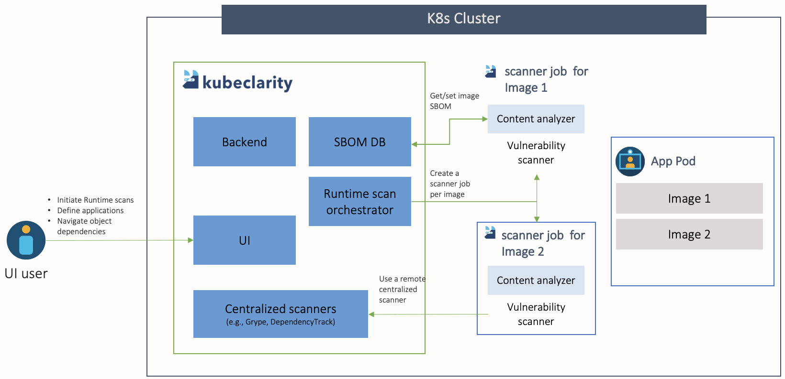



## Runtime Scan Features

OpenClarity enhance the runtime scanning experience:

### Faster Runtime Scan

OpenClarity optimizes the scanning process, reducing the time required to detect vulnerabilities. This allows for quicker identification and remediation of potential security risks.

### Reduce Image TAR Pulling

OpenClarity uses an efficient approach that avoids the unnecessary overhead of fetching the complete image tar.

### Cache SBOMs

If an image has already been scanned, OpenClarity uses the cached SBOM data, avoiding time-consuming image retrieval and recomputing, improving overall efficiency.

## Runtime Scan Architecture

The following figure illustrates the structure of a runtime scanning architecture. This layout visually represents the components and their interconnections within the runtime scanning system.

## Perform Runtime Scan

For details on performing runtime scans with OpenClarity, see the {}.

## Asset Discovery

The OpenClarity stack supports the automatic discovery of assets in Kubernetes:

| Asset types                      | Scope                 | Installation                                                     |
|----------------------------------|-----------------------|------------------------------------------------------------------|
| Docker containers and images     | Cluster               | {} |
