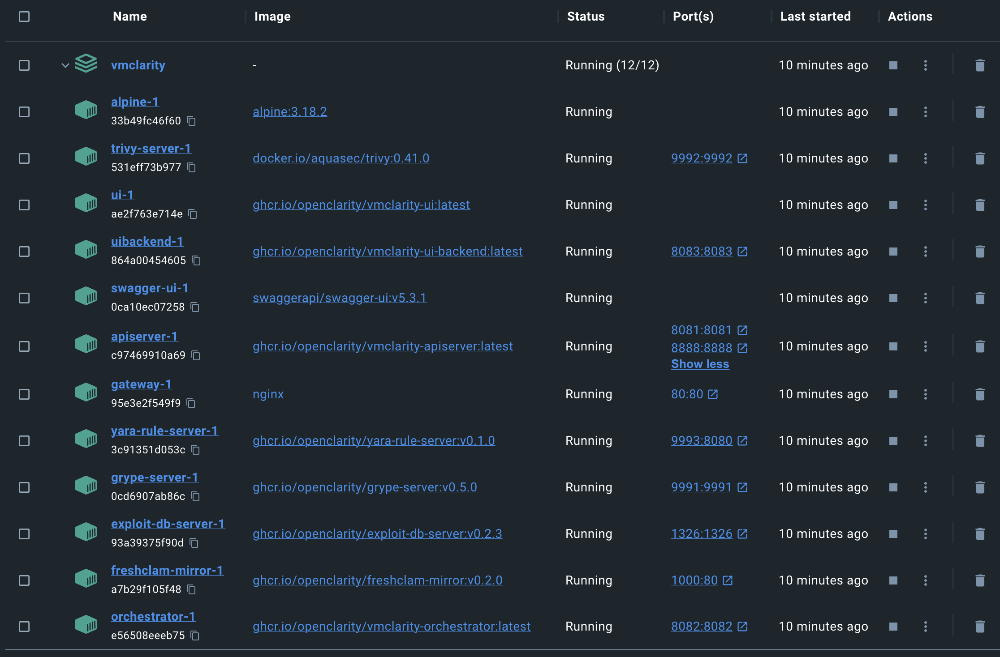

## Prerequisites

* Install [Docker](https://docs.docker.com/get-docker/).

## Deployment steps

To run OpenClarity in Docker on a local machine, complete the following steps.

1. Download the latest OpenClarity release.

    ```shell
    wget https://github.com/openclarity/openclarity/releases/download/v/docker-compose-v.tar.gz
    ```

1. Create a new directory, extract the files and navigate to the directory.

    ```shell
    mkdir docker-compose-v
    tar -xvzf docker-compose-v.tar.gz -C docker-compose-v
    cd docker-compose-v
    ```

1. Start every control plane element with the docker compose file.

    ```shell
    docker compose --project-name openclarity --file docker-compose.yml up -d --wait --remove-orphans
    ```

    The output should be similar to:

    ```
    [+] Running 14/14
    ⠿ Network openclarity                        Created                                                       0.2s
    ⠿ Volume "openclarity_grype-server-db"       Created                                                       0.0s
    ⠿ Volume "openclarity_apiserver-db-data"     Created                                                       0.0s
    ⠿ Container openclarity-orchestrator-1       Healthy                                                      69.7s
    ⠿ Container openclarity-yara-rule-server-1   Healthy                                                      17.6s
    ⠿ Container openclarity-exploit-db-server-1  Healthy                                                      17.7s
    ⠿ Container openclarity-swagger-ui-1         Healthy                                                       7.8s
    ⠿ Container openclarity-trivy-server-1       Healthy                                                      26.7s
    ⠿ Container openclarity-uibackend-1          Healthy                                                      17.6s
    ⠿ Container openclarity-ui-1                 Healthy                                                       7.7s
    ⠿ Container openclarity-freshclam-mirror-1   Healthy                                                       7.8s
    ⠿ Container openclarity-grype-server-1       Healthy                                                      37.3s
    ⠿ Container openclarity-gateway-1            Healthy                                                       7.7s
    ⠿ Container openclarity-apiserver-1          Healthy                                                      17.7s
    ```

    Please note that the `image_override.env` file enables you to use the images you build yourself. You can override parameters in the `docker-compose.yml` by passing a custom env file to the `docker compose up` command via the `--env-file` flag. The `/installation/docker/image_override.env` file contains an example overriding all the container images.

1. Check the running containers in the Docker desktop.

    <p align="center" width="100%">
        
    </p>

1. Access the OpenClarity UI. Navigate to [http://localhost:8080/](http://localhost:8080/) in your browser.

    <p align="center" width="100%">
        
    </p>

## Next steps

Complete the {}.

## Clean up steps

1. After you've finished your tasks, stop the running containers.

    ```shell
    docker compose --project-name openclarity --file docker-compose.yml down --remove-orphans
    ```
