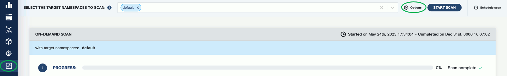
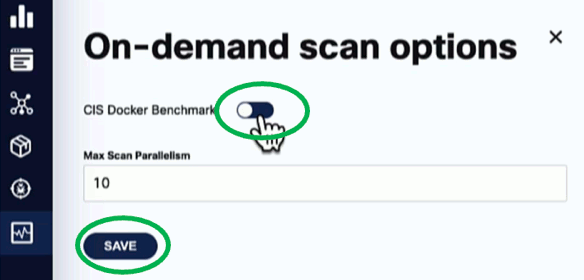
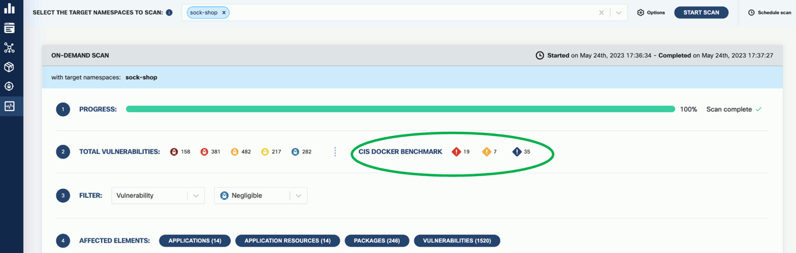
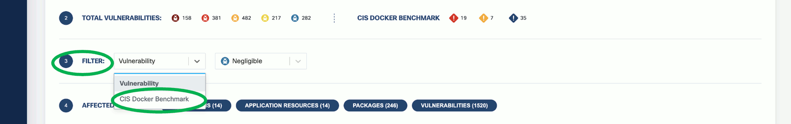
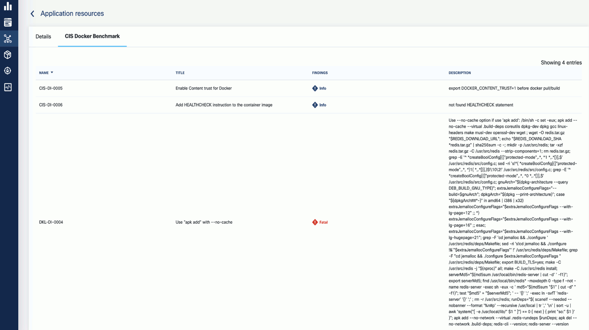

Developed by the Center for Internet Security (CIS), [CIS benchmarks](https://www.cisecurity.org/cis-benchmarks/) provide industry-recognized guidelines and recommendations for securing systems, networks, and software applications.

CIS Benchmarks are consensus-based guidelines that outline recommended security configurations and settings for various technology platforms, including operating systems, databases, web servers, and more. For more details, see [CIS Docker Benchmark: Guidance for securing Docker containers](https://www.cisecurity.org/benchmark/docker/) and [
CIS Kubernetes Benchmark: Guidance for securing Kubernetes clusters](https://www.cisecurity.org/benchmark/kubernetes/).

## Configure CIS benchmarking

By following these steps and customizing the CIS benchmarks configuration in the `values.yaml` file, you can effectively run and assess your Kubernetes cluster’s adherence to the CIS benchmarks and evaluate fatal, info, and warning level findings. To configure KubeClarity for running CIS benchmarks, complete the following steps.

1. Clone or download the KubeClarity repository to your local machine, and open the [`values.yaml`](https://github.com/openclarity/kubeclarity/blob/main/charts/kubeclarity/values.yaml) file in a text editor.
1. Locate the `cis-docker-benchmark-scanner` section.
1. Customize the configuration based on your specific requirements. You can enable or disable specific CIS benchmarks, set thresholds, and define compliance levels.
    <!-- FIXME what/how can be set here? -->
    For example:

    ```yaml
    cis-docker-benchmark-scanner:
    ## Docker Image values.
    docker:
      ## Use to overwrite the global docker params
      ##
      imageName: ""

    ## Scanner logging level (debug, info, warning, error, fatal, panic).
    logLevel: warning

    ## Timeout for the cis docker benchmark scanner job.
    timeout: "2m"

    resources:
      requests:
        memory: "50Mi"
        cpu: "50m"
      limits:
        memory: "1000Mi"
        cpu: "1000m"
    ```

1. Save the changes to the configuration file.
1. [Deploy the KubeClarity backend]() in your Kubernetes cluster using the modified `values.yaml` file.
1. Once KubeClarity is up and running, it automatically applies the configured CIS benchmarks and evaluates your Kubernetes cluster against them.
1. Monitor the KubeClarity dashboard, or check the generated reports to review your cluster’s compliance with the CIS benchmarks.

## Enable CIS benchmarks

To enable the configured benchmark scans for on-demand runtime scans, complete the following steps.

1. 
1. From the navigation bar on the left, select **Runtime Scan**, then **Options**.

    

1. Enable the **CIS Docker Benchmark** option, then click **SAVE**.

    

## CIS benchmark results

1. If you run a scan with CIS benchmarks enabled, the scan results are shown in the scan report:

    

1. You can drill down further by applying filters. The filter allows you to narrow down the results and focus on the specific aspects you are interested in. Use the provided filters to navigate the CIS benchmark details and access the necessary information for your compliance analysis.

    

1. Click on a group in the **AFFECTED ELEMENTS** row to see the alerts and the details.

1. Click **CIS Docker Benchmark** to see a drill-down view of CIS Benchmarks and a detailed benchmark description. This deeper level of visibility enables you to investigate and address the alerts more effectively, ensuring the security and compliance of your Kubernetes environment.

    
