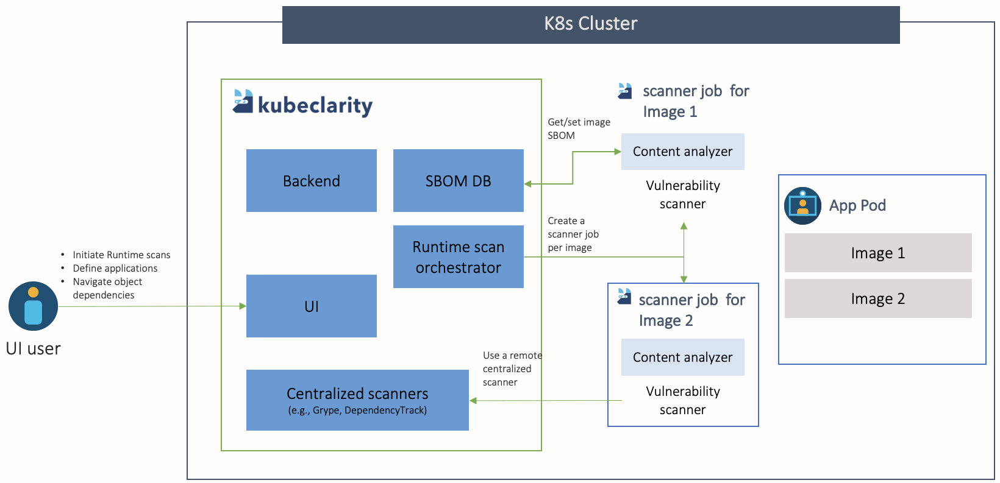



## Runtime scan features

KubeClarity enhance the runtime scanning experience:

### Faster runtime scan

KubeClarity optimizes the scanning process, reducing the time required to detect vulnerabilities. This allows for quicker identification and remediation of potential security risks.

### Reduce image TAR pulling

KubeClarity uses an efficient approach that avoids the unnecessary overhead of fetching the complete image tar.

### Cache SBOMs

If an image has already been scanned, KubeClarity uses the cached SBOM data, avoiding time-consuming image retrieval and recomputing, improving overall efficiency.

## Runtime scan architecture

The following figure illustrates the structure of a runtime scanning architecture. This layout visually represents the components and their interconnections within the runtime scanning system.

## Perform runtime scan

For details on performing runtime scans with KubeClarity, see the {} and {}.
