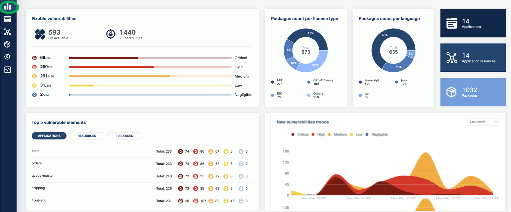

After you have [installed the KubeClarity backend]() and the [KubeClarity CLI](), complete the following tasks to see the basic functionality of KubeClarity, either using the [CLI](), or using the web UI.

## Runtime scan

To start a [runtime scan]() from the UI, complete the following steps.

1. 
1. From the navigation bar on the left, select **Runtime Scan**.

    

1. Select the namespace you want to scan, for example, the `sock-shop` namespace if you have installed the demo application, then click **START SCAN**. You can select multiple namespaces.

    

1. Wait until the scan is completed, then check the results. The scan results report the affected components such as **Applications**, **Application Resources**, **Packages**, and **Vulnerabilities**.

    

1. Click on these elements for details. For example, **Applications** shows the applications in the namespace that have vulnerabilities detected.

    

    Now that you have run a scan, a summary of the results also appears on the dashboard page of the UI.

    

## Vulnerability scan {#vulnerability-scan-results-ui}


