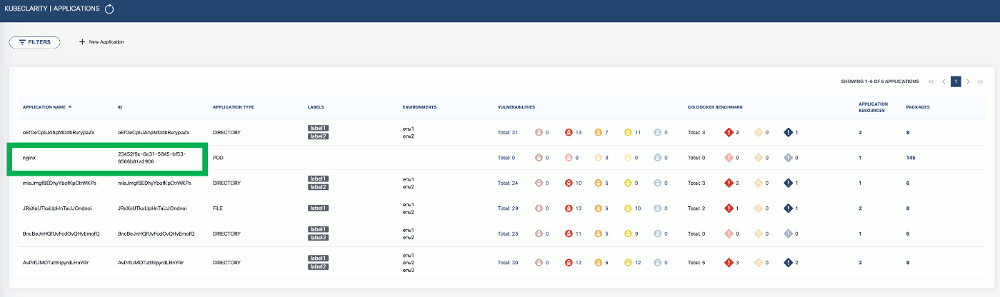
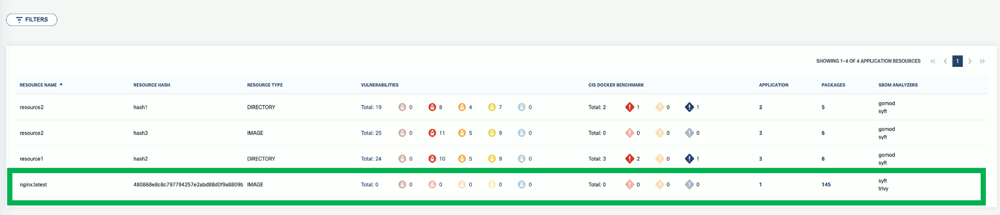



## Export scan results to backend

1. To export the analyzer results to the backend, grab the **ID** from the KubeClarity UI.

    

1. To export the scan results to a running KubeClarity backend pod, use the `-e` flag and the ID as the `<application ID>` value in the following command.

    ```shell
    BACKEND_HOST=<KubeClarity backend address> BACKEND_DISABLE_TLS=true kubeclarity-cli analyze <image> --application-id <application ID> -e -o <SBOM output file>
    ```

    For example:

    ```shell
    BACKEND_HOST=localhost:8080 BACKEND_DISABLE_TLS=true kubeclarity-cli analyze nginx:latest --application-id 23452f9c-6e31-5845-bf53-6566b81a2906 -e -o nginx.sbom
    ```

    Example output:

    ```shell
    INFO[0000] Called syft analyzer on source registry:nginx:latest  analyzer=syft app=kubeclarity
    INFO[0004] Called trivy analyzer on source image nginx:latest  analyzer=trivy app=kubeclarity
    INFO[0004] Skipping analyze unsupported source type: image  analyzer=gomod app=kubeclarity
    INFO[0004] Sending successful results                    analyzer=syft app=kubeclarity
    INFO[0004] Got result for job "syft"                     app=kubeclarity
    INFO[0004] Got result for job "gomod"                    app=kubeclarity
    INFO[0004] Sending successful results                    analyzer=trivy app=kubeclarity
    INFO[0004] Got result for job "trivy"                    app=kubeclarity
    INFO[0004] Skip generating hash in the case of image    
    INFO[0004] Exporting analysis results to the backend: localhost:8080  app=kubeclarity
    ```

1. Now you can see the exported results on the UI. For the `nginx` image, the **SBOM Analyzers** column now also displays `trivy`.

    

## Run multiple generators

You can list the content analyzers to use using the `ANALYZER_LIST` environment variable separated by a space (`ANALYZER_LIST="<analyzer 1 name> <analyzer 2 name>"`). For example:

```shell
ANALYZER_LIST="syft gomod" kubeclarity-cli analyze --input-type image nginx:latest -o nginx.sbom
```


