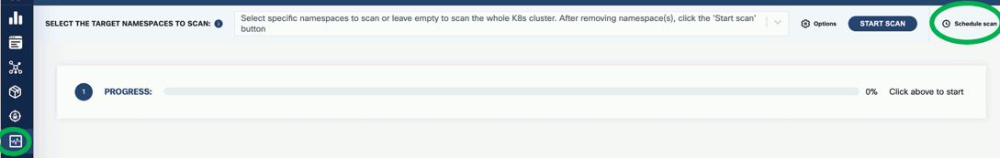
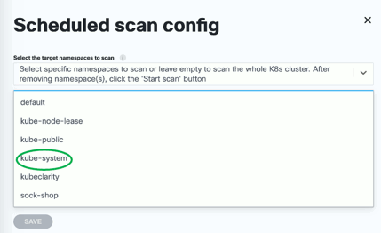
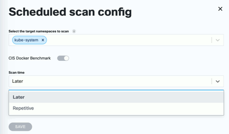
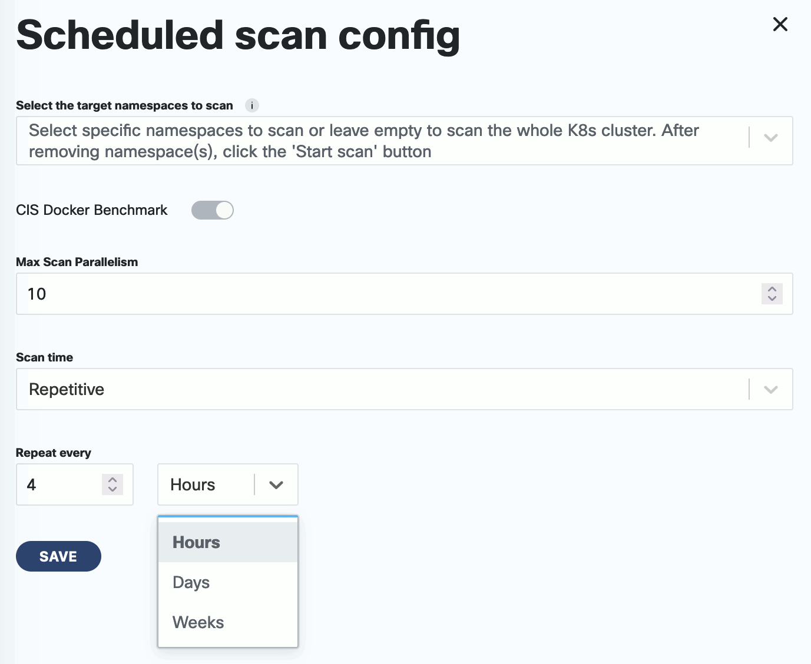

To schedule a runtime scan that runs at a specific time, complete the following steps. You can also configure recurring scans to periodically scan your namespaces.

1. 
1. From the navigation bar on the left, select **Runtime Scan**.
1. Click **Schedule Scan**.

    

1. Select the namespace or namespaces you want to scan.

    

1. (Optional) If you have already configured [CIS benchmarks](), you can select **CIS Docker Benchmark** to enable them for the scheduled scan.

1. Set the type of the scan.

    - **Later**: Run the scan once at the specified time.
    - **Repetitive**: A recurring scan that runs periodically.

    

1. Set the time of the scan, then click **SAVE**.

    - For a one-time scan, set the date and time when it should run.
    - For a repetitive scan, set its frequency.
        <!-- FIXME when will it run first? -->

    
