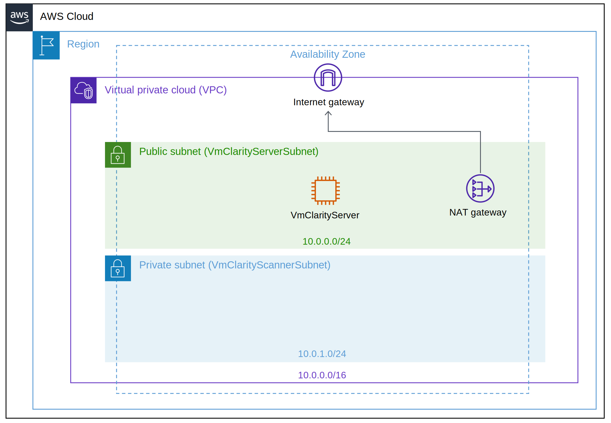
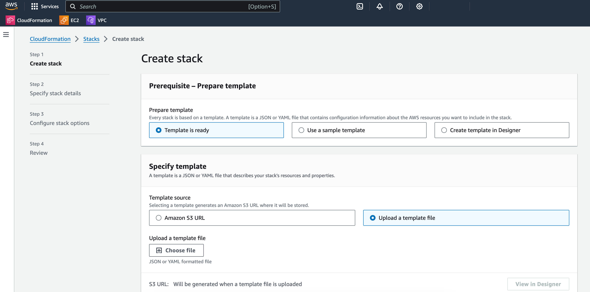
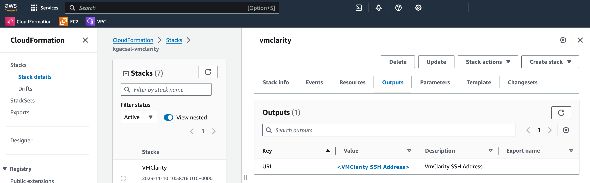

An AWS CloudFormation template is provided for quick deployment of the VMClarity environment.

> Note: To avoid extra costs (cross-region snapshots), you may want to deploy the VMClarity AWS CloudFormation template in the same region where the majority of the VMs are that you want to scan with VMClarity.

The following figure shows the basic AWS resources that the VMClarity CloudFormation template creates:

- a VPC with a public and private subnet, and
- an AWS Internet Gateway (IGW) and NAT Gateway (NGW) into the VPC.

The public subnet (`VmClarityServerSubnet`) hosts the VMClarity Server (`VmClarityServer`) EC2 instance. The VMClarity server houses the scanning configuration, the UI, and other control components. The EC2 instance is assigned an external IPv4 address (EIP) for SSH and web UI access.

The private subnet (`VmClarityScannerSubnet`) hosts the VM snapshot instances (EC2) that are scanned for security vulnerabilities.

## Prerequisites

* Have an AWS account.
* Create an [EC2 key pair](https://docs.aws.amazon.com/AWSCloudFormation/latest/UserGuide/cfn-console-create-keypair.html).

## Deployment steps

To deploy the VMClarity AWS CloudFormation Stack, complete the following steps.

1. Log in to the AWS CloudFormation console.

    - Click [here](https://console.aws.amazon.com/cloudformation/home#/stacks/create/review?stackName=VMClarity&templateURL=https://s3.eu-west-2.amazonaws.com/vmclarity-v/VmClarity.cfn) to start the VMClarity CloudFormation Stack wizard.
    - Alternatively, you can:

        1. Download the `aws-cloudformation-v.tar.gz` asset from the [VMClarity releases page](https://github.com/openclarity/vmclarity/releases), or copy the [AWS CloudFormation template file](https://github.com/openclarity/vmclarity/blob/main/installation/aws/VmClarity.cfn) from the project repository to deploy the latest development code.
        1. Go to the AWS CloudFormation service page, then select **Create Stack > With New Resources (standard)**.
        1. Check **Template is ready** and **Upload a template file**, then click **Upload a template file/Choose file**.

    

        
    

1. In the VMClarity CloudFormation Stack wizard, set the following:

    1. Enter a name for the stack.
    1. Select the **InstanceType** (defaults to `t2.large` for the VMClarity Server, and the scanner VMs).
    1. Specify the SSH key for the EC2 instance in the **KeyName** field. You will need this key to connect to VMClarity.
    1. Adjust **SSHLocation** according to your policies.
    1. Do not change **AdvancedConfiguration**, unless you are building from a custom registry.
    1. Click **NEXT**.
    1. (Optional) Add tags as needed for your environment. You can use the defaults unless you need to adjust for your own policies.
    1. Click **NEXT**, then scroll to the bottom of the screen, and check **I acknowledge...**.
    1. Click **SUBMIT**.

1. Once the stack is deployed successfully, copy the VMClarity SSH address from the Outputs tab.

    

        
    

1. [Open the VMClarity UI](/docs/vmclarity/getting-started/install-vmclarity#access-ui).
