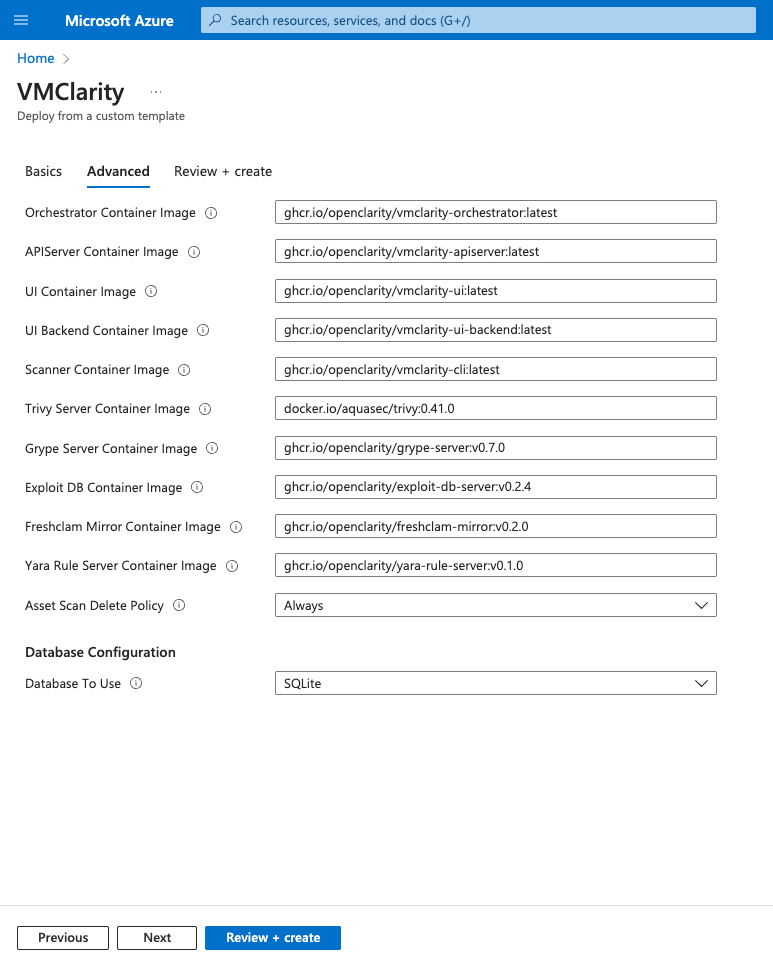

## Prerequisites

* Have an Azure subscription.
* Create a SSH public key for Linux. Please follow [these instructions for Linux and Mac users](https://learn.microsoft.com/en-gb/azure/virtual-machines/linux/mac-create-ssh-keys?WT.mc_id=Portal-fx) or [these for Windows users](https://learn.microsoft.com/en-gb/azure/virtual-machines/linux/ssh-from-windows). Once a RSA private key is created, convert it to a SSH2 public key with:

```sh
ssh-keygen -e -f ~/.ssh/id_rsa.pub > ~/.ssh/id_rsa2.pub
```

## Deployment steps

1. Click [here](https://portal.azure.com/#blade/Microsoft_Azure_CreateUIDef/CustomDeploymentBlade/uri/https%3A%2F%2Fraw.githubusercontent.com%2Fopenclarity%2Fvmclarity%2Fmain%2Finstallation%2Fazure%2Fvmclarity.json/uiFormDefinitionUri/https%3A%2F%2Fraw.githubusercontent.com%2Fopenclarity%2Fvmclarity%2Fmain%2Finstallation%2Fazure%2Fvmclarity-UI.json) to deploy VMClarity's custom template.

2. Fill out the required project and instance details in the Basics tab.

| Parameter                             | Required | Description                                                                                          |
|---------------------------------------|----------|------------------------------------------------------------------------------------------------------|
| Subscription                          | True     | Azure subscription where resources will be billed.                                                   |
| Region                                | False    | Azure region where resources will be deployed.                                                       |
| VMClarity Deploy Postfix              | True     | Postfix for Azure resource group name (e.g. `vmclarity-<postfix>`).                                  |
| VMClarity Server SSH Username         | True     | SSH Username for the VMClarity Server Virtual Machine.                                               |
| VMClarity Server SSH Public Key       | True     | SSH Public Key for the VMClarity Server Virtual Machine.                                             |
| VMClarity Server VM Size              | True     | The size of the VMClarity Server Virtual Machine.                                                    |
| VMClarity Scanner VMs Size            | True     | The size of the VMClarity Scanner Virtual Machines.                                                  |
| Security Type                         | False    | Security Type of the VMClarity Server Virtual Machine, e.g. `TrustedLaunch` (default) or `Standard`. |

<p align="center" width="100%">
    
</p>

**[TODO center table]**
**[TODO next sections]**

3. To run a specific VMClarity version, go to the Advanced tab and select the Container Images that should be used for each service.

<p align="center" width="100%">
    
</p>

4. Review and create the deployment.
5. [TBC] Once deployed, copy the VMClarity SSH address from the Outputs tab.
