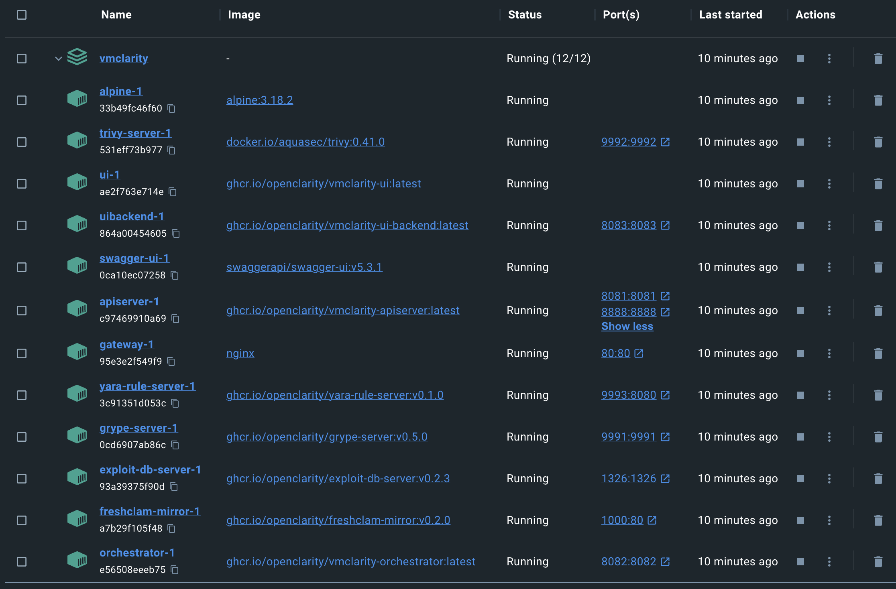

## Prerequisites

* Install [Docker](https://docs.docker.com/get-docker/).

## Deployment steps

To run VMClarity in Docker on a local machine, complete the following steps.

1. Clone the project repository and navigate to the `/installation/docker` folder.

    ```shell
    git clone https://github.com/openclarity/vmclarity.git
    cd vmclarity/installation/docker
    ```

2. Start every control plane element with the docker compose file.

    ```shell
    docker compose --project-name vmclarity --file docker-compose.yml up -d --wait --remove-orphans
    ```

    Please note that the `image_override.env` file enables you to use the images you build yourself. You can override parameters in the `docker-compose.yml` by passing a custom env file to the `docker compose up` command via the `--env-file` flag. The `/installation/docker/image_override.env` file contains an example overriding all the container images.

3. Check the running containers in the Docker desktop.

    <p align="center" width="100%">
        
    </p>

4. Open the VMClarity UI in your browser at [http://localhost:80/](http://localhost:80/).

1. Complete the {}.

1. After you've finished your tasks, stop the running containers.

    ```shell
    docker compose --project-name vmclarity --file docker-compose.yml down --remove-orphans
    ```
